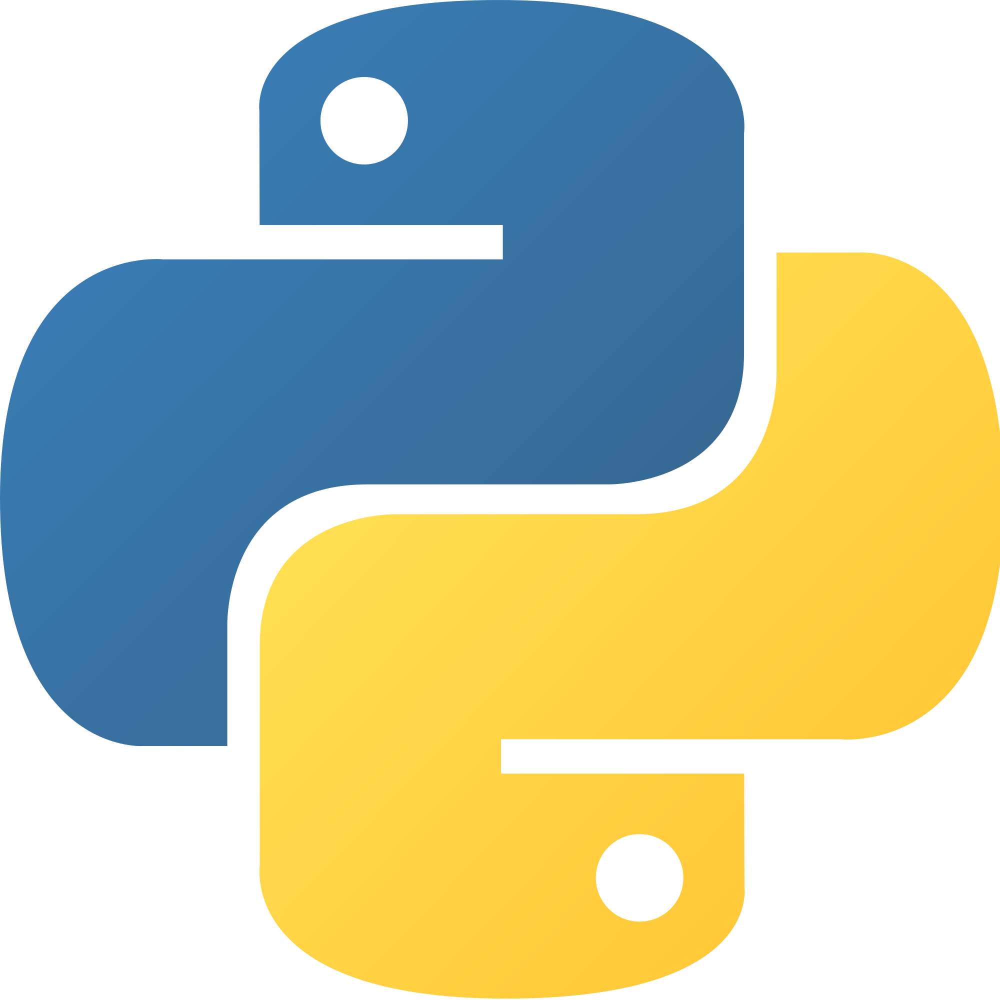
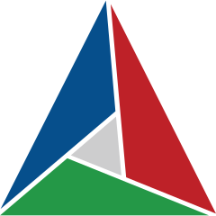
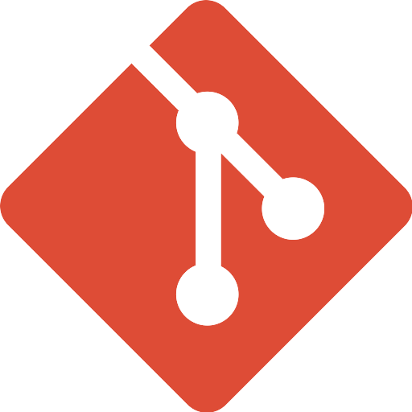

<h1 align="center">Hi 👋, I'm Gjin Rexhaj</h1>
<h3 align="center">Third-year university student majoring in Computer Science and minoring in Mathematics.</h3>
 

- 🔭 I’m currently working on **3d renderer using OpenGL**

- 🌱 I’m currently learning **C, C++, and Kotlin**

- 👨‍💻 All of my public projects are available at [https://gjinrexhaj.github.io/](https://gjinrexhaj.github.io/)

- 📫 How to reach me: **gjin.contact@gmail.com**

 
<h3 align="left">Language and Tool Proficiencies:</h3>

 
                 
                 
                 
                 
                 
                 
                 

C++, Java, Python, CMake, Git, Bash, Linux, QT
