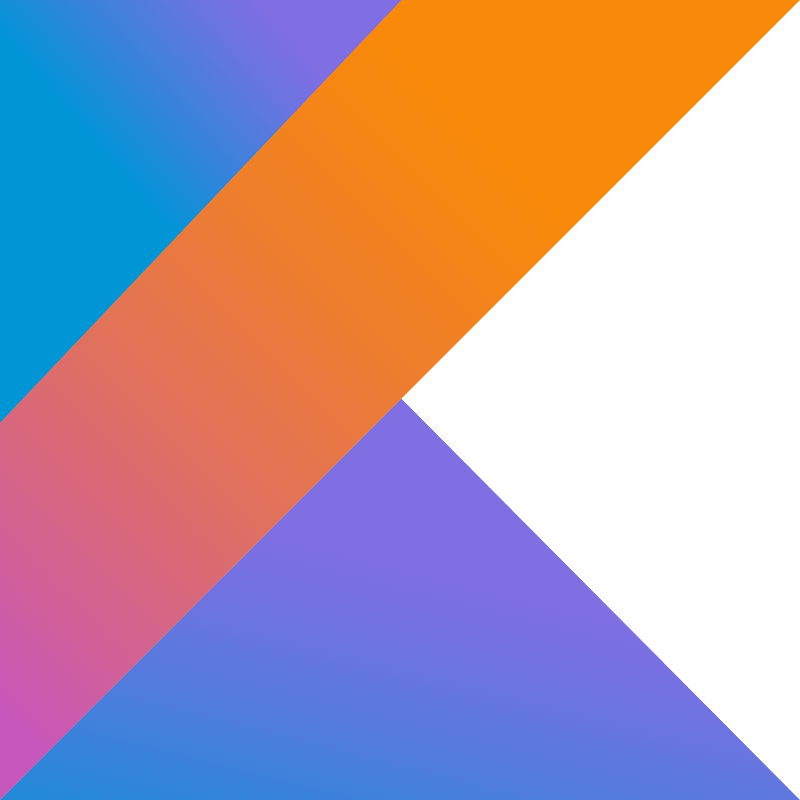

<h1 align="center">Hi 👋, I'm Gjin</h1>
<h3 align="center">Fourth-year university student majoring in Computer Science and minoring in Mathematics.</h3>
 

- 🔭 I’m currently working on **implementing a cellular automata engine**

- 🌱 I’m currently learning **Godot, C#, and AvaloniaUI**

- 🧑‍💻 Portfolio: **https://gjinrexhaj.streamlit.app/**

- 📫 How to reach me: **gjin.contact@gmail.com**

 

<h3 align="left">Language and Tool Proficiencies:</h3>

| C                                                        | C++                                                          | Java                                                           | Kotlin                                                             | Firebase                                                               | Python                                                             | CMake                                                            | git                                                          | bash                                                           | Linux                                                            | QT                                                         |
|----------------------------------------------------------|--------------------------------------------------------------|----------------------------------------------------------------|--------------------------------------------------------------------|------------------------------------------------------------------------|--------------------------------------------------------------------|------------------------------------------------------------------|--------------------------------------------------------------|----------------------------------------------------------------|------------------------------------------------------------------|------------------------------------------------------------|
|  |  |  |  |  |  |  |  |  |  |  | 

<!--
<h3 align="left">Language and Tool Proficiencies:</h3>

 
                 
                 
                 
                 
                 
                 
                 
                 
                 
                 

-->
